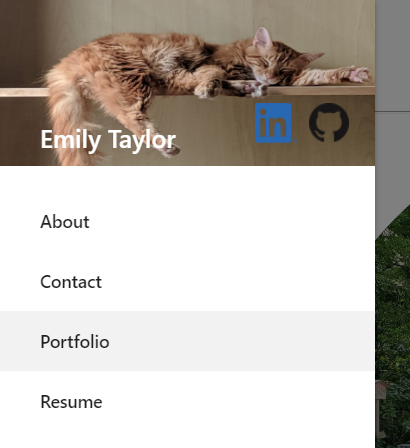

# Portfolio Project

## Recreating my Portfolio using Materialize and Javascript

Throughout the UT coding bootcamp, we are updating our portfolios to show off new technologies we have learn. In this iteration of my portfolio, I have included javascript and the Materialize framework. There isn't too much javascript but there is quite a bit of Materialize. It was a fun framework to work with and I plan on getting more familiar with it in the future.

## Original Portfolio Link

https://emilyporterfieldtaylor.github.io/original_bootstrap_portfolio/

## Accomplishments

The thing I'm most proud of this my new sidenav. It was the first thing I worked on using Materialize and it took me quit a while to get it working. I'm very proud of it :)

Original Nav: 

## Credits

I would like to give credit to my cat Calcifer who let me use his photo in my side nav. He's the cutest

## License

